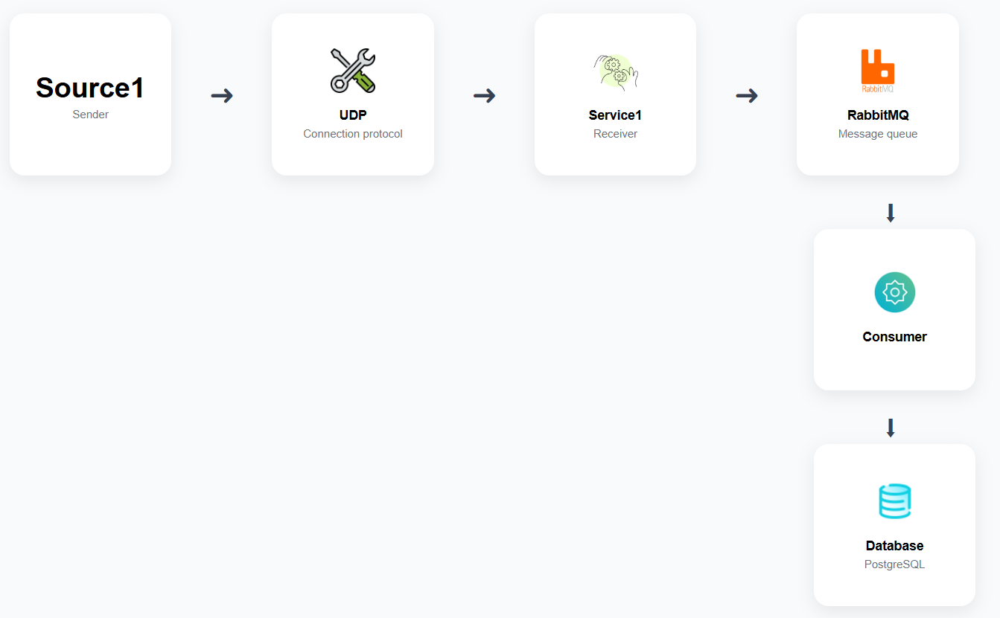

# Mohirdev UDP Project

## Overview

This project implements a **secure UDP-based communication system** with
a **data diode architecture**, ensuring one-way data flow between
services.

It consists of three main components:

- **Source1** → Sends UDP messages  
- **Service1** → Receives UDP messages and pushes them into RabbitMQ  
- **Consumer Service** → Reads messages from RabbitMQ and writes them into the database  

The project also includes:

- **RabbitMQ** → Message broker for reliable and asynchronous data handling  
- **Database (PostgreSQL)** → Persistent storage for processed messages  
- **Prometheus + Grafana** → Monitoring and observability stack for metrics and dashboards

------------------------------------------------------------------------
## Diagram
<div align="center">
  
</div>

------------------------------------------------------------------------

## Project Structure

    mohirdev/
    |── Consumer/              Write to database
    │   ├── consumer.py     
    │   ├── Dockerfile
    │   ├── requirements.txt   
    │
    │── Source1/               message sender using connection UDP protocol
    │   ├── client.py
    │   ├── Dockerfile
    │   ├── requirements.txt   
    │
    │── Service1/              message receiver using connection UDP protocol
    │   ├── server.py
    │   ├── Dockerfile
    │   ├── requirements.txt  
    │
    │── prometheus.yml         
    │── promtail-config.yaml   
    │── docker-compose.yml     
    │── nginx.conf            
    │── README.md              

------------------------------------------------------------------------

## Features

-   **UDP-based communication** (fast, lightweight protocol)
-   **Data diode architecture** (ensures one-way communication from
    Source1 → Service1)
-   **RabbitMQ integration** (message queue for reliable processing)
-   **Prometheus & Grafana** (monitoring and observability)
-   **Docker & Docker Compose** support for containerized deployment

------------------------------------------------------------------------
<details>
<summary>Installation & Setup</summary>

### 1️⃣ Clone the Repository

``` bash
git clone https://github.com/Shohruxshoh/udp_webhook.git
cd udp_webhook
```

### 2️⃣ Build and Start Services

``` bash
docker-compose up --build
```

### 3️⃣ Verify Running Services

-   **Source1** → UDP client\
-   **Service1** → UDP server with RabbitMQ integration\
-   **Prometheus** → <http://localhost:9090>\
-   **Grafana** → <http://localhost:3000>

------------------------------------------------------------------------

## Configuration

-   **Environment Variables** are stored in `.env` files. Example:

``` env
See .env.example
```

-   **Nginx (UDP Load Balancer)** configuration (`nginx.conf`):

``` nginx
stream {
    upstream udp_backend {
        least_conn;
        server service1:9999;
    }
    server {
        listen 9999 udp;
        proxy_pass udp_backend;
    }
}
```
------------------------------------------------------------------------
</details>


## Error Handling & Logging

-   **Structured JSON logs** using `python-json-logger`
-   Centralized error handling in `server.py` and `client.py`
-   Automatic reconnection to RabbitMQ in case of failure

------------------------------------------------------------------------

## Monitoring

-   **Prometheus** scrapes metrics from RabbitMQ and services
-   **Grafana dashboards** for real-time system monitoring

